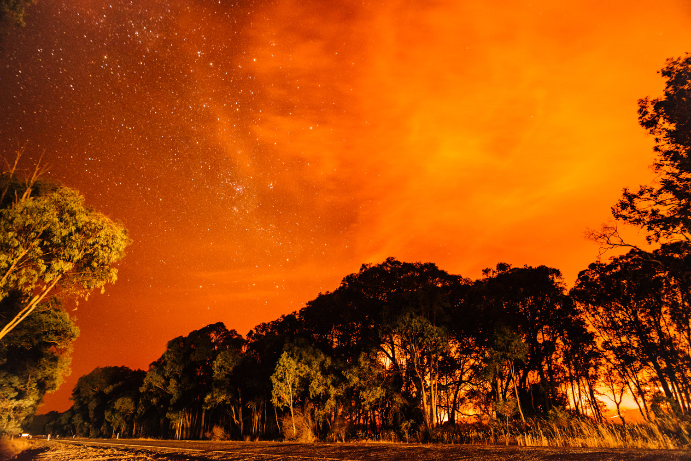
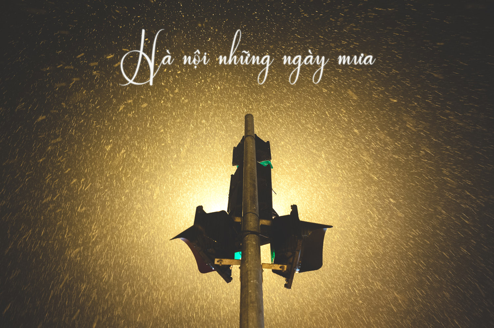
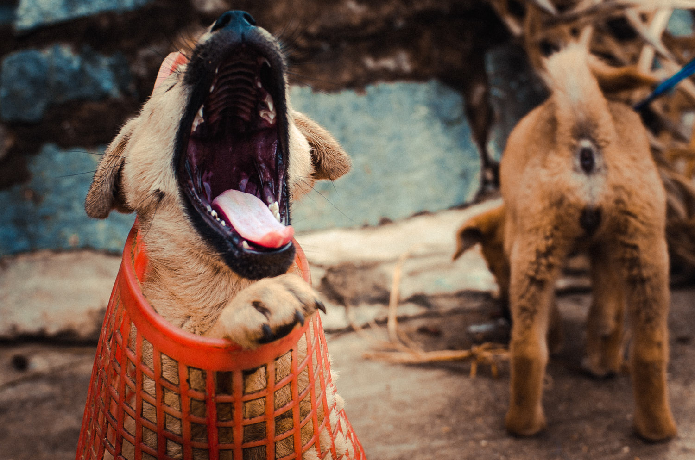
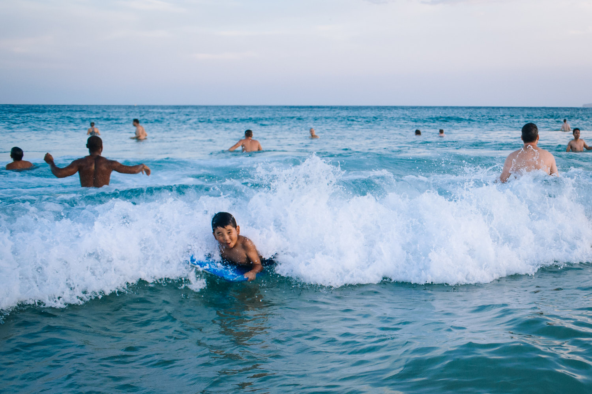
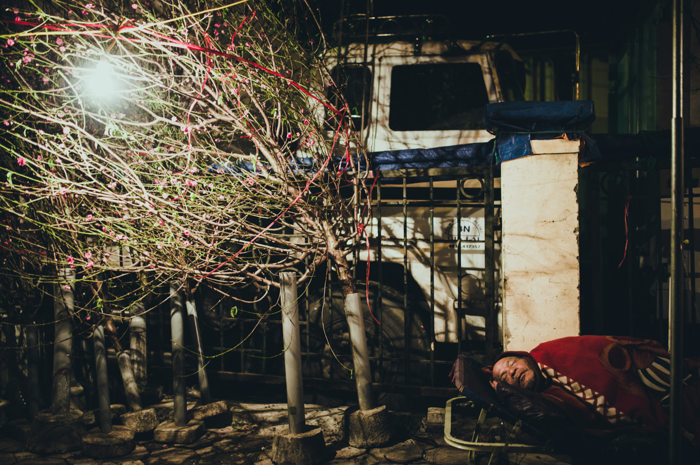

```{=html}
<section class="block" style="border-bottom:none; padding-bottom:.5rem;">
  <p class="eyebrow">Photos</p>
</section>

<section class="albums">
  <button class="album album--w3" data-album="bushfire">
    <span class="album__frame"></span>
    <span class="album__name">Bushfire 2019</span>
  </button>
  <button class="album album--w3" data-album="hanoi-rain">
    <span class="album__frame"></span>
    <span class="album__name">Hanoi Rain</span>
  </button>
  <button class="album album--w2" data-album="animals">
    <span class="album__frame"></span>
    <span class="album__name">Animals</span>
  </button>
  <button class="album album--w2" data-album="lived-fully">
    <span class="album__frame"></span>
    <span class="album__name">Lived Fully</span>
  </button>
  <button class="album album--w2" data-album="sleep">
    <span class="album__frame"></span>
    <span class="album__name">Sleep</span>
  </button>
</section>

<div class="lightbox" id="lightbox" role="dialog" aria-modal="true" aria-hidden="true" aria-labelledby="lb-title">
  <div class="lightbox__inner">
    <header class="lightbox__bar">
      <div class="lightbox__head">
        <h2 class="lightbox__title" id="lb-title"></h2>
        <p class="lightbox__desc" id="lb-desc"></p>
      </div>
      <button class="lightbox__close" id="lb-close" aria-label="Close album">&times;</button>
    </header>
    <div class="lightbox__grid" id="lb-grid"></div>
  </div>
</div>

<div class="viewer" id="viewer" role="dialog" aria-modal="true" aria-hidden="true">
  <button class="viewer__close" id="v-close" aria-label="Close photo">&times;</button>
  <button class="viewer__nav viewer__nav--prev" id="v-prev" aria-label="Previous photo">&#8249;</button>
  <button class="viewer__nav viewer__nav--next" id="v-next" aria-label="Next photo">&#8250;</button>
  <figure class="viewer__stage" id="v-stage"></figure>
  <div class="viewer__count" id="v-count"></div>
</div>

<footer class="site-foot">
  <span>Duc Thai Tran — Sydney</span>
  <span><a href="mailto:ducthai.tran@outlook.com">ducthai.tran@outlook.com</a></span>
  <span>© 2026</span>
</footer>

<script>
(function(){
  // ── EDIT HERE ──────────────────────────────────────────────
  // For each album, set the description and the NUMBER of photos.
  // Put the photos in images/albums/<album>/ named 01.jpg, 02.jpg, …
  // (two digits: 01–09, then 10, 11, … — the cover is cover.jpg)
  const pad = n => String(n).padStart(2,'0');
  const seq = (dir,n) => Array.from({length:n}, (_,i)=>`images/albums/${dir}/${pad(i+1)}.jpg`);

  const ALBUMS = {
    "bushfire":    { title:"Bushfire 2019",
      desc:"In 2019, I found myself in the path of one of Australia's most ferocious mega-blazes. These photos are a record of survival, of standing at the edge of something ancient and overwhelming, and making it out the other side.",
      photos: seq("bushfire", 7) },
    "hanoi-rain":  { title:"Hanoi Rain",
      desc:"Rain has a way of washing the world down to its bones. In Hanoi, beneath skies that wept without warning, the noise of modern life softened and faded, and what remained were simply people, present and unadorned, belonging to nothing but the moment.",
      photos: seq("hanoi-rain", 27) },
    "animals":     { title:"Animals",
      desc:"Whether wild or domestic, every creature carries its own quirks, its own way of moving through the world. To photograph them is to recognise that variety is not unique to us. Nature has always been generous with difference.",
      photos: seq("animals", 19) },
    "lived-fully": { title:"Lived Fully",
      desc:"Some people seek stillness and solitude. Others find their joy in laughter and company. This collection is a celebration of all of it, because there is no single right way to be alive, and that is the whole point.",
      photos: seq("lived-fully", 21) },
    "sleep":       { title:"Sleep",
      desc:"Sleep is the one moment we cannot perform for anyone. The posture, the place, the hour, all of it quietly tells a story about who a person truly is when no one is watching.",
      photos: seq("sleep", 8) },
  };
  // ───────────────────────────────────────────────────────────

  // Album lightbox
  const lb=document.getElementById('lightbox'), grid=document.getElementById('lb-grid'),
        title=document.getElementById('lb-title'), desc=document.getElementById('lb-desc'),
        close=document.getElementById('lb-close'), inner=lb.querySelector('.lightbox__inner');
  // Photo viewer
  const viewer=document.getElementById('viewer'), vImg=document.getElementById('v-img'),
        vStage=document.getElementById('v-stage'), vCount=document.getElementById('v-count'),
        vClose=document.getElementById('v-close'), vPrev=document.getElementById('v-prev'),
        vNext=document.getElementById('v-next');

  let scrollY=0, lastFocus=null, current=[], currentTitle='', vIndex=0;

  function open(id){
    const a=ALBUMS[id]; if(!a) return;
    current=a.photos; currentTitle=a.title;
    title.textContent=a.title; desc.textContent=a.desc||'';
    grid.innerHTML=a.photos.map(function(src,i){
      return '<figure class="lb-photo" data-i="'+i+'"></figure>';
    }).join('');
    scrollY=window.scrollY; lastFocus=document.activeElement;
    document.body.style.top=(-scrollY)+'px'; document.body.classList.add('lb-locked');
    lb.classList.add('is-open'); lb.setAttribute('aria-hidden','false');
    inner.scrollTop=0; close.focus();
    document.addEventListener('keydown', onKey);
  }
  function shut(){
    if(viewer.classList.contains('is-open')) closeViewer();
    lb.classList.remove('is-open'); lb.setAttribute('aria-hidden','true');
    document.body.classList.remove('lb-locked'); document.body.style.top='';
    window.scrollTo(0, scrollY);
    if(lastFocus) lastFocus.focus();
    document.removeEventListener('keydown', onKey);
  }
  function onKey(e){
    if(viewer.classList.contains('is-open')) return; // viewer handles its own keys
    if(e.key==='Escape') shut();
  }

  // ── Full-screen photo viewer ──
  function showPhoto(i){
    vIndex=(i+current.length)%current.length;
    vImg.classList.remove('is-zoomed'); vImg.style.transformOrigin='center';
    vImg.src=current[vIndex];
    vImg.alt=currentTitle+' — '+(vIndex+1);
    vCount.textContent=(vIndex+1)+' / '+current.length;
  }
  function openViewer(i){
    showPhoto(i);
    viewer.classList.add('is-open'); viewer.setAttribute('aria-hidden','false');
    vClose.focus();
    document.addEventListener('keydown', vKey);
  }
  function closeViewer(){
    viewer.classList.remove('is-open'); viewer.setAttribute('aria-hidden','true');
    vImg.classList.remove('is-zoomed');
    document.removeEventListener('keydown', vKey);
  }
  function vKey(e){
    if(e.key==='Escape'){ e.stopPropagation(); closeViewer(); }
    else if(e.key==='ArrowLeft') showPhoto(vIndex-1);
    else if(e.key==='ArrowRight') showPhoto(vIndex+1);
  }

  // open viewer when a grid photo is clicked
  grid.addEventListener('click', function(e){
    const fig=e.target.closest('.lb-photo'); if(fig) openViewer(+fig.dataset.i);
  });
  vPrev.addEventListener('click', function(e){ e.stopPropagation(); showPhoto(vIndex-1); });
  vNext.addEventListener('click', function(e){ e.stopPropagation(); showPhoto(vIndex+1); });
  vClose.addEventListener('click', function(e){ e.stopPropagation(); closeViewer(); });
  // click backdrop (outside the image) closes
  viewer.addEventListener('click', function(e){
    if(e.target===viewer || e.target===vStage) closeViewer();
  });
  // click image toggles a closer zoom; move cursor to pan while zoomed
  vImg.addEventListener('click', function(e){
    e.stopPropagation();
    vImg.classList.toggle('is-zoomed');
  });
  vStage.addEventListener('mousemove', function(e){
    if(!vImg.classList.contains('is-zoomed')) return;
    const r=vImg.getBoundingClientRect();
    const x=Math.min(100,Math.max(0,((e.clientX-r.left)/r.width)*100));
    const y=Math.min(100,Math.max(0,((e.clientY-r.top)/r.height)*100));
    vImg.style.transformOrigin=x+'% '+y+'%';
  });

  document.querySelectorAll('.album').forEach(function(btn){
    btn.addEventListener('click', function(){ open(btn.getAttribute('data-album')); });
  });
  close.addEventListener('click', shut);
})();
</script>
```
